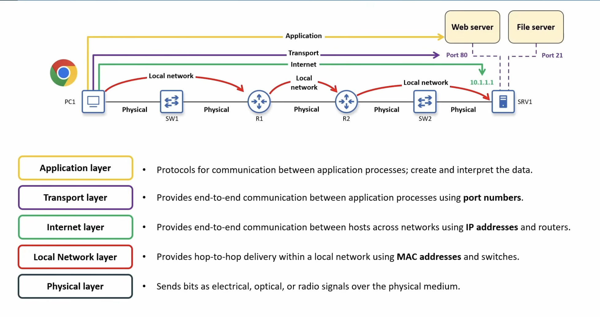
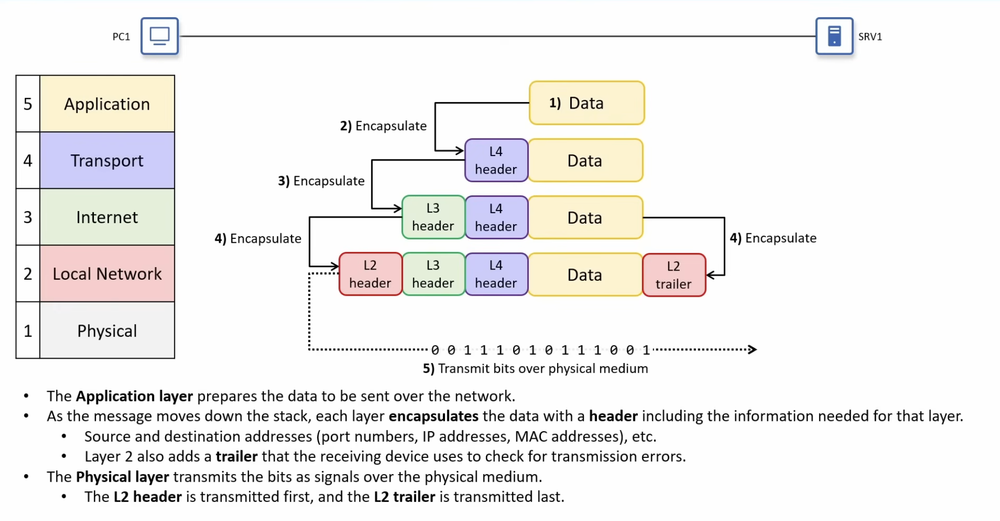
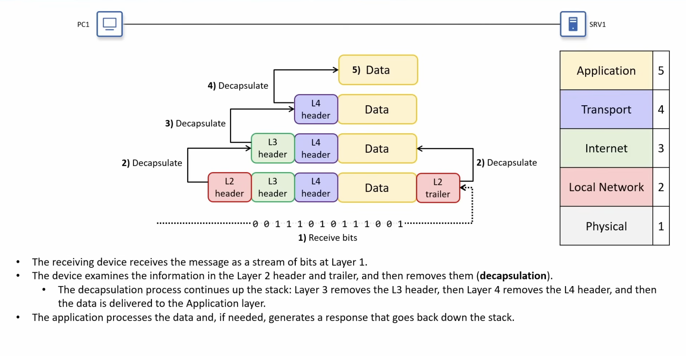
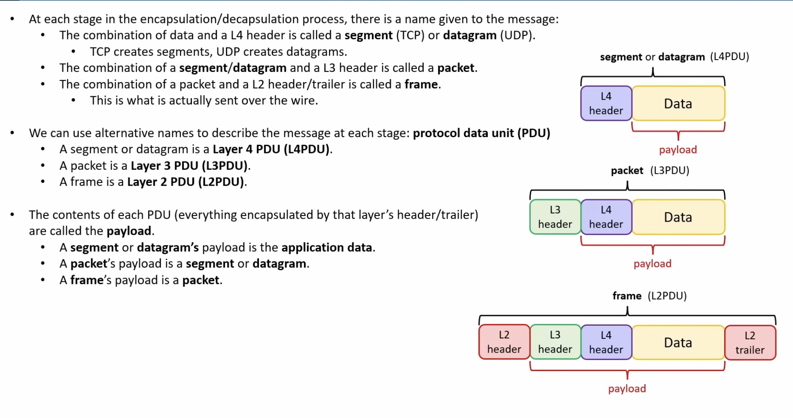

# Day 03 — TCP/IP Model


# Why Networking Uses Layers

Modern networks are divided into layers.

Each layer performs one specific job while relying on the layer below it.

Benefits:
- Easier troubleshooting
- Easier upgrades
- Standardization
- Different vendors can create compatible devices
- Each layer focuses on only one responsibility

---

# TCP/IP Five-Layer Model



| Layer | Main Responsibility | Uses |
|--------|---------------------|------|
| Layer 5 | Application | Applications & protocols |
| Layer 4 | Transport | Port numbers |
| Layer 3 | Internet | IP Addresses & Routers |
| Layer 2 | Local Network | MAC Addresses & Switches |
| Layer 1 | Physical | Electrical/Optical/Radio Signals |

---

# Layer 1 — Physical Layer

Moves raw bits across the physical medium.

Examples
- UTP cable
- Fiber optic cable
- Wi-Fi radio
- Network Interface Card (NIC)

Responsibilities
- Electrical signals
- Optical signals
- Radio signals
- Connectors
- Cable types
- Link speeds


---

# Layer 2 — Local Network Layer
Provides **hop-to-hop delivery** inside a LAN.

Uses:
- MAC Addresses
- Ethernet
- Wi-Fi
- Switches

Example
PC → Router1 → Router2 → Server

Hops:
1. PC → Router1
2. Router1 → Router2
3. Router2 → Server

**Switches DO NOT count as hops.**

---

### Important

Layer 2 identifies devices using - MAC Addresses


---

# Layer 3 — Internet Layer
Provides **end-to-end communication between hosts.**

Uses
- IP Addresses
- Routers

Instead of worrying about every hop, Layer 3 only cares about reaching the final destination.

Protocols
- IPv4
- IPv6
- ICMP

Think:

> **IP + Routers**

---

# Layer 4 — Transport Layer

Provides communication between application processes.

Instead of identifying computers...

It identifies **applications**.

Uses:
- Port Numbers

Protocols
- TCP
- UDP

Think:

> **Process-to-process communication**

---

# Layer 5 — Application Layer

Allows applications to communicate.

Examples
- HTTP
- HTTPS
- FTP
- TFTP
- Email protocols

Examples of applications
- Chrome
- Firefox
- Edge
- File Transfer software

The Application Layer defines
- Message format
- Rules
- Interpretation

Think:
> **What the user actually uses**

---

# End-to-End vs Hop-to-Hop

## End-to-End

Communication between Source Host → Destination Host

Uses
- IP Address
- Port Number

Layers
- Layer 3
- Layer 4

---

## Hop-to-Hop

Communication between neighboring devices.

Uses
- MAC Address

Layer
- Layer 2

---

# Encapsulation

When sending data

Each layer adds its own header.

Application Data

↓

Layer 4 Header

↓

Layer 3 Header

↓

Layer 2 Header

↓

Layer 2 Trailer

↓

Bits on the cable

---

Headers Added

Layer 4

- Port Numbers

Layer 3

- IP Addresses

Layer 2

- MAC Addresses

Trailer

- Error detection



---

# Decapsulation

Receiving device performs the reverse process.

Layer 1

↓

Layer 2 removes Header & Trailer

↓

Layer 3 removes Header

↓

Layer 4 removes Header

↓

Application reads the data



---

# Protocol Data Units (PDUs)



### Easy Memory

```
Data

↓

Segment/Datagram

↓

Packet

↓

Frame

```


---

# Adjacent Layer Interaction

Each layer provides services to the layer above it.
Each layer depends on the one below it.

---

# Same Layer Interaction

Each layer communicates logically with the same layer on another device.


---

# TCP/IP vs OSI

## TCP/IP (5 Layers)

| Layer |
|--------|
| Application |
| Transport |
| Internet |
| Local Network |
| Physical |

---

## OSI (7 Layers)

| Layer |
|--------|
| Application |
| Presentation |
| Session |
| Transport |
| Network |
| Data Link |
| Physical |

---

## Key Difference

OSI splits the top three layers.
TCP/IP combines them into one Application Layer.

---

# Devices by Layer

| Device | Primary Layer |
|----------|--------------|
| Hub | Layer 1 |
| Switch | Layer 2 |
| Router | Layer 3 |
| Firewall | Layers 3-7 (varies) |
| PC | Uses all layers |
| Server | Uses all layers |

---

# Protocols by Layer

| Layer | Examples |
|--------|----------|
| Application | HTTP, HTTPS, FTP, TFTP |
| Transport | TCP, UDP |
| Internet | IPv4, IPv6, ICMP |
| Local Network | Ethernet, Wi-Fi |
| Physical | Copper, Fiber, Radio |

---


# Memory Tricks

Layer order

```
Application

Transport

Internet

Local Network

Physical
```

Mnemonic:

> **All Teachers Inspire Lazy People ( ATILP)**


---

# Key Takeaways

- Layer 1 sends bits.
- Layer 2 delivers to the next hop using MAC addresses.
- Layer 3 delivers to the final host using IP addresses.
- Layer 4 delivers to the correct application using port numbers.
- Layer 5 defines how applications communicate.
- Encapsulation adds headers.
- Decapsulation removes headers.
- TCP creates Segments.
- UDP creates Datagrams.
- Packets travel inside Frames.
- Frames travel as Bits.
- Layer 4 PDU is called a segment

---