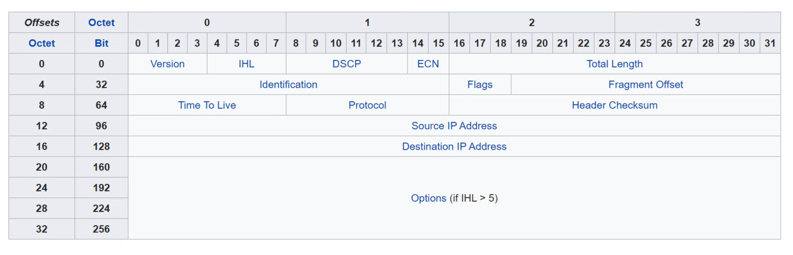

### Day 10 — IPv4 Header 🖧

1. **Version (4 bits):**

   * Tells the version of IP being used (IPv4 or IPv6).
   * For IPv4, this field is always set to 4 (binary: 0100).

2. **IHL (Internet Header Length) (4 bits):**

   * Specifies the length of the IPv4 header in 4-byte increments.
   * The minimum value is 5, which means a 20-byte header (no options).
   * The maximum value is 15, which means a 60-byte header (with options).
   * **If IHL > 5, the Options field is present.**

3. **DSCP (Differentiated Services Code Point) (6 bits):**

   * Used for Quality of Service (QoS) to prioritize certain types of traffic (e.g., voice or video).

4. **ECN (Explicit Congestion Notification) (2 bits):**

   * Helps notify devices about network congestion without dropping packets.
   * **Optional and requires support from the endpoints and network.**

5. **Total Length (16 bits):**

   * Indicates the total size of the packet (header + data) in bytes.
   * The maximum size is 65,535 bytes.
   * **Unlike IHL, this is measured directly in bytes.**

6. **Identification (16 bits):**

   * Used to identify fragments of the same packet if the packet is split into smaller pieces.
   * **All fragments from the same original packet have the same Identification value.**
   * Fragmentation can occur when a packet is larger than the **MTU** (typically 1500 bytes).

7. **Flags (3 bits):**

   * Controls fragmentation:

     * **Don’t Fragment (DF):** If set to 1, the packet cannot be fragmented.
     * **More Fragments (MF):** If set to 1, there are more fragments coming.
     * **MF = 0:** Indicates the last fragment or an unfragmented packet.
     * **Bit 0 is reserved and always 0.**

8. **Fragment Offset (13 bits):**

   * Shows the position of the fragment in the original packet.
   * **Allows fragments to be reassembled in the correct order, even if they arrive out of order.**

9. **Time to Live (TTL) (8 bits):**

   * Prevents packets from looping forever.
   * Each router decreases the TTL by 1. If it reaches 0, the packet is dropped.
   * **TTL is essentially a hop count in practice.**

10. **Protocol (8 bits):**

    * Indicates the protocol of the encapsulated data (e.g., TCP = 6, UDP = 17, ICMP = 1, OSPF = 89).

11. **Header Checksum (16 bits):**

    * Used to check for errors in the IPv4 header (not the data).
    * **TCP/UDP have their own checksums for the encapsulated data.**

12. **Source IP Address (32 bits):**

    * The IP address of the sender.

13. **Destination IP Address (32 bits):**

    * The IP address of the receiver.

14. **Options (Variable length):**

    * Rarely used. Can add extra functionality to the header.
    * **Can be 0–40 bytes.**
    * **If IHL = 5 → no Options field.**
