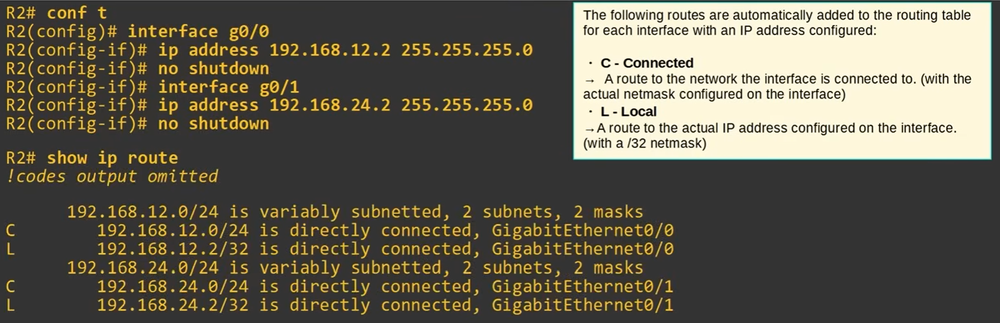

### Routing Fundamentals
Routing is the process of determining where packets should go next based on their destination IP address.

Routers can learn routes from:

Connected networks — automatically added when interfaces are configured.
Static routes (S) — manually configured by an administrator.
Dynamic routing protocols — routers learn routes from other routers, such as OSPF, EIGRP, and BGP.

Key idea: The routing table is essentially the router's map of available networks and the paths it can use to reach them.

Yep — that’s an important **Day 11 CCNA concept**. Your note is correct, but I’d tighten it up for revision:

### Day 11 — Routing Table

**`show ip route`**
Displays the router's routing table.

When you configure an IP address on an interface and enable it with **`no shutdown`**, the router automatically adds **two routes** to its routing table:

1. **Connected route (`C`)**

   * Represents the directly connected network.
   * Example:

     ```text
     C 192.168.1.0/24 is directly connected, GigabitEthernet0/0
     ```

2. **Local route (`L`)**

   * Represents the **specific IP address configured on the router's interface**.
   * Example:

     ```text
     L 192.168.1.1/32 is directly connected, GigabitEthernet0/0
     ```

### Example




### STATIC ROUTE CONFIGURATION

A **static route** is a route that an administrator manually configures on a router. It tells the router **where to send packets when the destination network is not already known**.

#### 3 Ways to Configure a Static Route

**1. Next-hop IP address — use this one for now**

```text
ip route <network-address> <netmask> <next-hop-IP>
```

Example:

```text
R1(config)# ip route 192.168.4.0 255.255.255.0 10.0.0.2
```

* `192.168.4.0` → destination network
* `255.255.255.0` → destination network mask
* `10.0.0.2` → **next-hop router's IP address**

> **For the lab:** R1 and R4 only need **1 static route**, while the other routers need **2 static routes**.

---

**2. Exit interface only**

```text
ip route <network-address> <netmask> <exit-interface>
```

Example:

```text
ip route 192.168.4.0 255.255.255.0 g0/1
```

This tells the router which interface to send the packet out of.

> This method relies on **Proxy ARP** in many Ethernet scenarios.

---

**3. Exit interface + next-hop**

```text
ip route <network-address> <netmask> <exit-interface> <next-hop-IP>
```

This specifies **both** the outgoing interface and the next-hop router.

---

### DEFAULT ROUTE

A **default route** is used when the router **doesn't have a more specific route** for the destination.

```text
ip route 0.0.0.0 0.0.0.0 <next-hop-IP>
```

Example:

```text
R1(config)# ip route 0.0.0.0 0.0.0.0 10.0.0.2
```

Remember:

```text
0.0.0.0 0.0.0.0
```

means **"any destination network."**

You can think of a default route as:

> **"If I don't know where to send it, send it this way."**

### VERIFY YOUR ROUTES

```text
do show ip route
```

Look for:

```text
S    → Static route
S*   → Default static route
C    → Connected route
L    → Local route
```

**Key idea:**
`C` and `L` routes are automatically created from configured interfaces, while **`S` routes are manually configured by you**.

