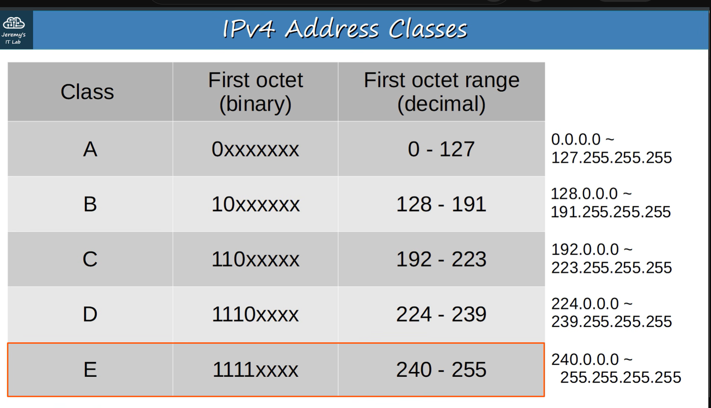
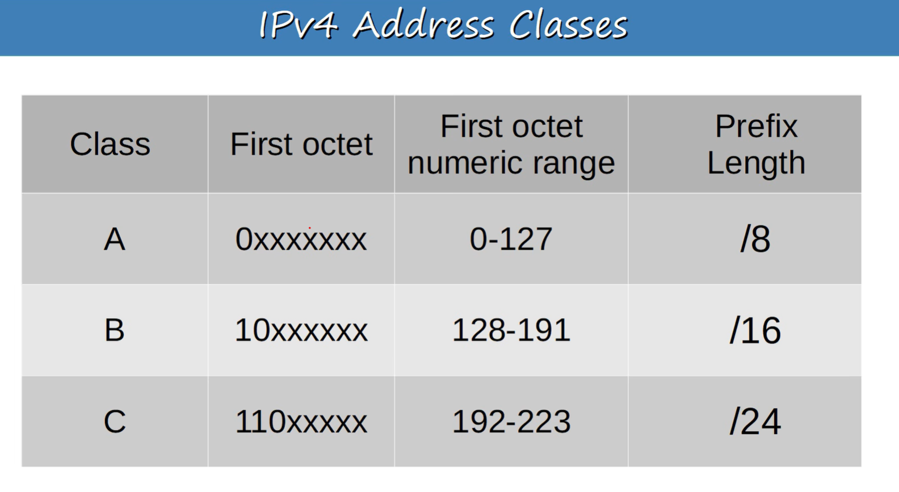
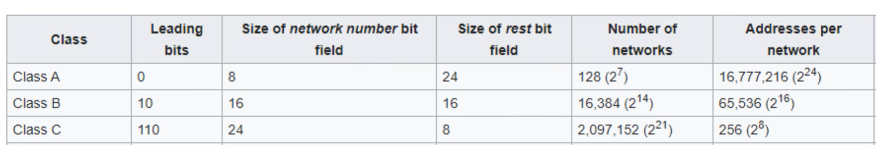
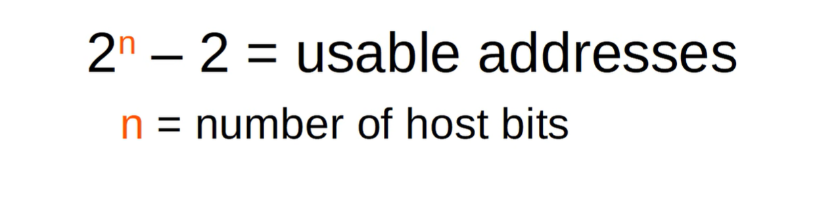
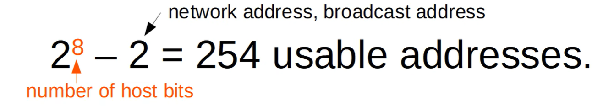
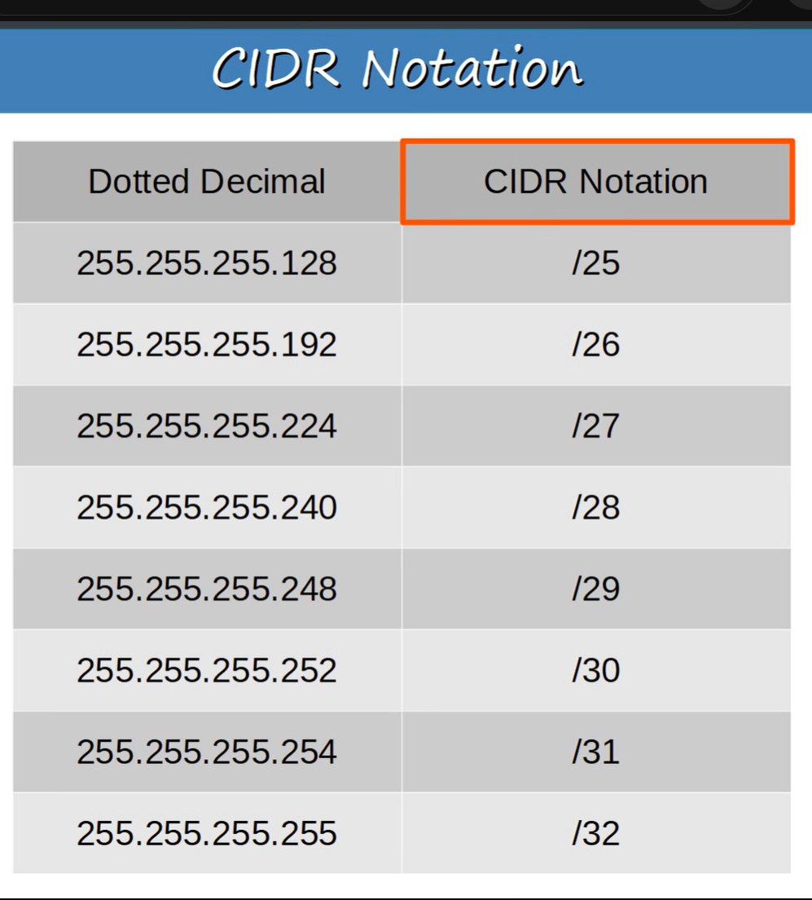

### Subnetting

remember - Class|first octet binary |First octet decimal/numeric range | prefix length 
so ni vitu nne iwe table yako
combine below  tables into one using above

### Formula to get usable addresses per network/hosts

Class A = /8 ==  2^24 -2
Class B = /16 == 2^16 -2
Class C = /24 == 2^8 -2
for class C check below 

### shika kwa kichwa (subnetting class C network)

You can use /30 or even better /31 subnet for point to point