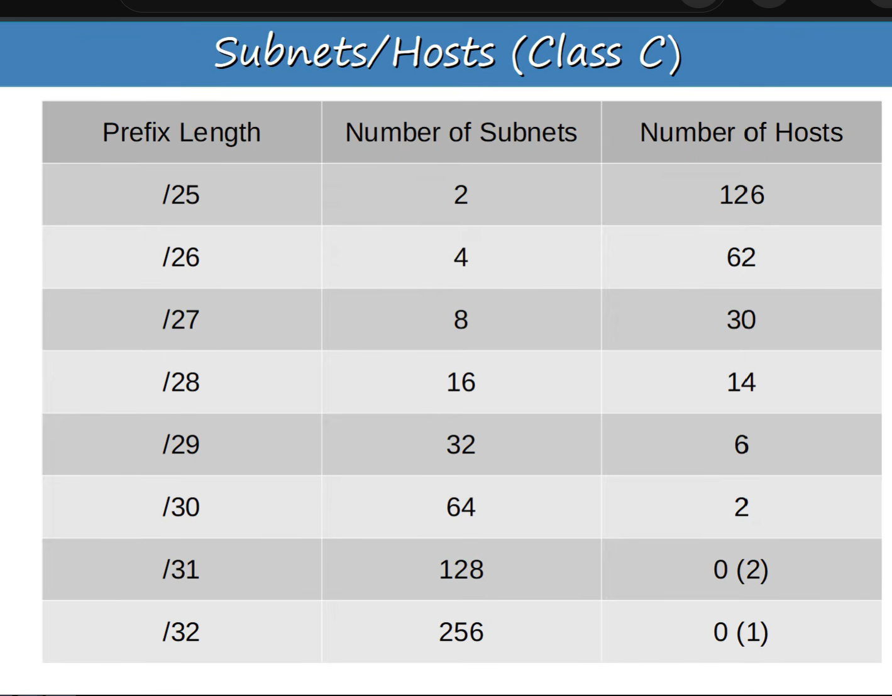
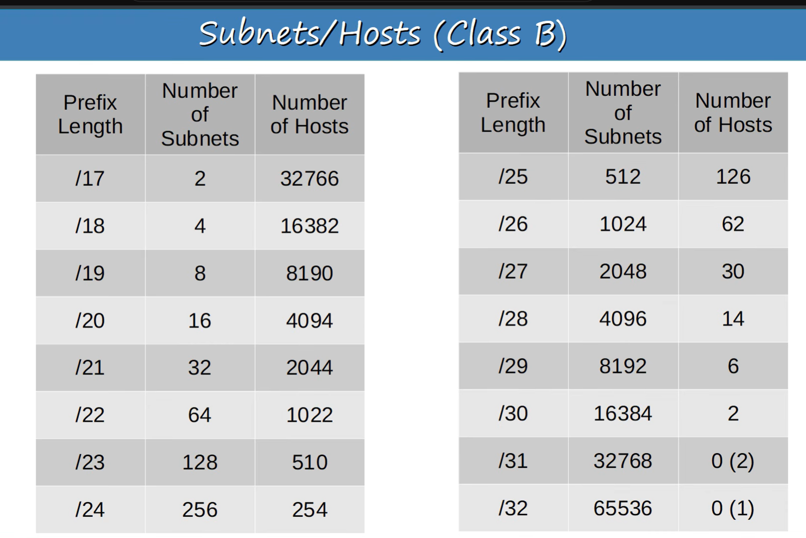

### Subnetting Part 2

from above /31 shows zero after minus network address and broadcast address but it can be used in point to point net

for me RM

prefix len | 128, 192, 224, 240 going down | /25=2^7, /26=2^6 (RM - we minus 32) we get no of host dont forget to minus 2 | additional ni No of subnets ie /25 ni 2 (formula is 2^1 {x = No borrowed bits}) | alafu you can turn to binary ie /25 yake ni 10000000 - so you can see borrowed bit is one

### Class B subnets

