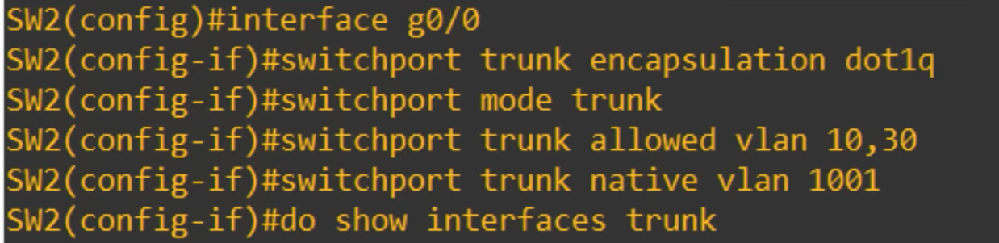

# Day 17 — VLANs Part 2

## 1. Trunk Ports

* **Access port:** Carries traffic for **one VLAN**.
* **Trunk port:** Carries traffic for **multiple VLANs** over one physical interface.
* Used between **switches** and between **switches and routers**.
* Trunks reduce the need for separate physical links for every VLAN.

## 2. VLAN Tagging — 802.1Q

* **802.1Q (dot1q):** Standard VLAN tagging protocol.
* Adds a **4-byte (32-bit) tag** to the Ethernet frame.
* The tag is inserted between the **Source MAC** and **Type/Length** fields.
* **ISL:** Old Cisco proprietary protocol; mainly know what it is for CCNA.

### 802.1Q Tag

| Field |    Size | Purpose                                                   |
| ----- | ------: | --------------------------------------------------------- |
| TPID  | 16 bits | Identifies an 802.1Q-tagged frame (`0x8100`)              |
| PCP   |  3 bits | Class of Service / traffic priority                       |
| DEI   |   1 bit | Indicates frames eligible to be dropped during congestion |
| VID   | 12 bits | Identifies the VLAN                                       |

* VLAN ID range: **1–4094**
* VLANs **0 and 4095** are reserved.
* Normal VLANs: **1–1005**
* Extended VLANs: **1006–4094**

## 3. Native VLAN

* Default native VLAN: **VLAN 1**
* Native VLAN frames are sent **without an 802.1Q tag**.
* An untagged frame received on a trunk is assumed to belong to the **native VLAN**.
* Native VLAN must **match on both sides of a trunk**.
* For security, use an **unused VLAN** as the native VLAN.

## 4. Trunk Configuration

```cisco
interface g0/0
switchport mode trunk
```

On switches supporting multiple encapsulation types:

```cisco
switchport trunk encapsulation dot1q
switchport mode trunk
```

Verify:

```cisco
show interfaces trunk
```

By default, **all VLANs (1–4094)** are allowed on a trunk.

### Limit Allowed VLANs

```cisco
switchport trunk allowed vlan 10,30
```

Other options:

```cisco
switchport trunk allowed vlan add 20
switchport trunk allowed vlan remove 20
switchport trunk allowed vlan all
switchport trunk allowed vlan except 1-5,10
switchport trunk allowed vlan none
```

Limiting allowed VLANs improves **security** and reduces unnecessary traffic.

### Native VLAN Configuration

```cisco
switchport trunk native vlan 1001
```




## 5. Router-on-a-Stick (ROAS)

**Purpose:** Perform **inter-VLAN routing using one physical router interface**.

Instead of:

```text
VLAN 10 → Physical Router Interface
VLAN 20 → Physical Router Interface
VLAN 30 → Physical Router Interface
```

Use one physical interface with multiple **subinterfaces**:

```text
G0/0.10 → VLAN 10
G0/0.20 → VLAN 20
G0/0.30 → VLAN 30
```

### Router Configuration

```cisco
interface g0/0
no shutdown

interface g0/0.10
encapsulation dot1q 10
ip address <IP> <subnet-mask>

interface g0/0.20
encapsulation dot1q 20
ip address <IP> <subnet-mask>

interface g0/0.30
encapsulation dot1q 30
ip address <IP> <subnet-mask>
```

* Subinterface numbers **do not have to match** VLAN numbers, but matching them is recommended.
* `encapsulation dot1q <VLAN>` associates the subinterface with that VLAN.
* Each subinterface receives an IP address and acts as the **default gateway** for its VLAN.
* The switch port connected to the router must be a **trunk**.
* The physical router interface itself does not need an IP address.

Verify:

```cisco
show ip interface brief
```

## 6. Key Points

* **Access = one VLAN**
* **Trunk = multiple VLANs**
* **802.1Q = VLAN tagging**
* **VID = identifies the VLAN**
* **Native VLAN = untagged traffic**
* **Native VLAN must match on both trunk ends**
* **ROAS = inter-VLAN routing using one physical router interface**
* **Subinterfaces = logical interfaces for each VLAN**
* **Router performs inter-VLAN routing; Layer 2 switches do not directly forward traffic between VLANs.**
