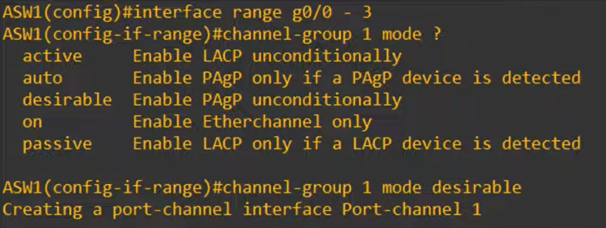
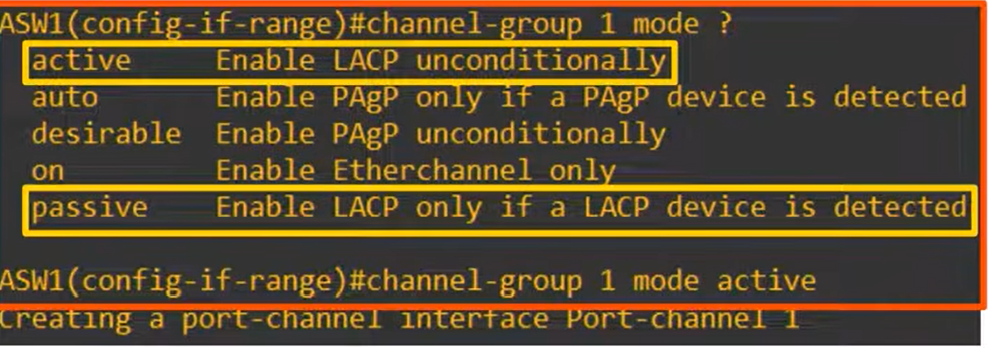
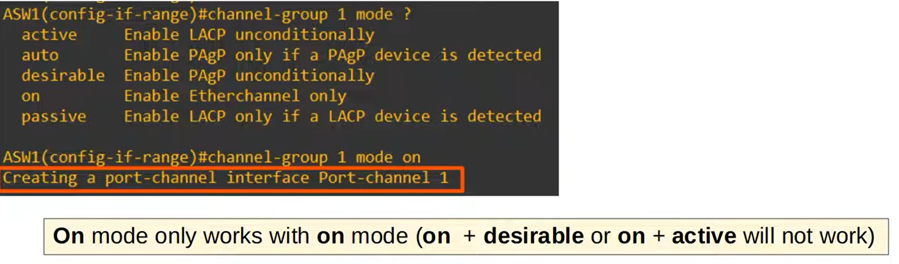

# Day 23 — EtherChannel

## 1. What is EtherChannel?

**EtherChannel** groups multiple physical interfaces into **one logical interface**.

* Also called **Port-Channel** or **LAG (Link Aggregation Group)**
* Multiple physical links → **one logical link**
* Provides:

  * **Increased bandwidth**
  * **Redundancy**
  * Better use of multiple physical links

### Why is it needed?

Normally, if multiple links connect two switches, **STP blocks all but one** to prevent Layer 2 loops.

EtherChannel solves this by making the physical links appear as **one logical interface** to STP.

> Example: 4 × 1-Gbps links → logically acts like a **4-Gbps link**.

---

## 2. EtherChannel and STP

Without EtherChannel:

```text
ASW1 ===== DSW1   ← Forwarding
     X====         ← STP blocks
     X====
     X====
```

With EtherChannel:

```text
ASW1 ═══════════ DSW1
     4 physical
     links
     = 1 logical
     Port-Channel
```

STP sees the entire EtherChannel as **one interface**, so all physical links can forward traffic.

**Important:** EtherChannel prevents STP from blocking links between the **two switches**, but Layer 2 loops can still exist when multiple switches form a larger topology. STP can still block an entire Port-Channel.

---

# 3. EtherChannel Load Balancing

EtherChannel does **not** send every frame randomly across the links.

It load-balances based on **flows**.

A flow = communication between two nodes.

For example:

```text
PC1 → Server1
PC1 → Printer1
PC2 → Printer1
```

Different flows can use different physical interfaces.

**Frames belonging to the same flow stay on the same physical interface** to avoid packets/frames arriving out of order.

Possible load-balancing inputs:

* Source MAC
* Destination MAC
* Source + destination MAC
* Source IP
* Destination IP
* Source + destination IP
* Some switches also support Layer 4 TCP/UDP ports

### Check load-balancing method

```cisco
show etherchannel load-balance
```

### Configure load-balancing

```cisco
conf t
port-channel load-balance <method> ie src-dst-mac - if want option use ? before method
do show etherchannel load-balance
```

---

# 4. EtherChannel Protocols

There are **three configuration methods**:

| Method     | Protocol          | Modes               |
| ---------- | ----------------- | ------------------- |
| **PAgP**   | Cisco proprietary | `desirable`, `auto` |
| **LACP**   | IEEE 802.3ad      | `active`, `passive` |
| **Static** | None              | `on`                |

### PAgP

**Port Aggregation Protocol**

* Cisco proprietary
* Only Cisco switches
* Dynamically negotiates EtherChannel

```text
desirable ↔ desirable = YES
desirable ↔ auto       = YES
auto ↔ auto            = NO
```

### LACP ⭐

**Link Aggregation Control Protocol**

* Industry standard
* IEEE **802.3ad**
* Works with different vendors
* **Preferred method**
* Required knowledge for the CCNA

```text
active ↔ active   = YES
active ↔ passive  = YES
passive ↔ passive = NO
```

### Static

```text
on ↔ on = YES
```

There is no negotiation protocol.

```text
on ↔ active    = NO
on ↔ desirable = NO
```

---

# 5. Maximum Interfaces

A normal EtherChannel can have up to **8 active interfaces**.

With LACP:

* Up to **16 interfaces**
* **8 active**
* **8 standby**

The standby interfaces can become active if an active interface fails.

---

### 6. Configuring EtherChannel
# PAgP Configuration



```cisco
int range g0/0 - 3
channel-group <number> mode <mode>
```

The channel-group number identifies the Port-Channel **locally**.

For example:

```cisco
channel-group 1 mode (auto/desirable
```

creates:

```text
Port-channel 1
```

The number must match among member interfaces **on the same switch**, but **does not have to match on the neighboring switch**.

Example:

```text
ASW1                         DSW1

channel-group 1              channel-group 2
       \                         /
        \_______________________/
              EtherChannel
```

This can still work.

---

# 7. LACP Configuration ⭐



For CCNA, focus heavily on:

```cisco
interface range g0/1-4
channel-group 1 mode active/passive
```

Neighbor can use:

```cisco
channel-group 1 mode passive
```

or:

```cisco
channel-group 1 mode active
```

Remember:

> **Active + Passive = YES**
> **Active + Active = YES**
> **Passive + Passive = NO**

---
# 7. STATIC  Configuration ⭐


# 8. EtherChannel Interface

The physical interfaces become members of the logical:

```text
Port-channel 1
```

You configure Layer 2 properties on the **Port-Channel interface**.

Example:

```cisco
interface port-channel 1
switchport mode trunk
```

The physical member interfaces inherit the relevant Port-Channel configuration.

---

# 9. EtherChannel Requirements ⭐

Member interfaces must have matching configurations.

They need matching:

* **Duplex**
* **Speed**
* **Switchport mode**

  * Access
  * Trunk
* If trunk:

  * Allowed VLANs
  * Native VLAN

If one interface doesn't match, it can be **excluded/suspended** from the EtherChannel.

### Important exam point

The member interfaces **do NOT need individual IP addresses**.

For a Layer 3 EtherChannel, the IP address goes on the **Port-Channel interface**.

---

# 10. EtherChannel Verification ⭐⭐⭐

### Most important command:

```cisco
show etherchannel summary
```

Example:

```text
Group  Port-channel  Protocol    Ports
1      Po1(SU)       LACP        Gi0/1(P)
                                  Gi0/2(P)
                                  Gi0/3(P)
                                  Gi0/4(P)
```

Know these flags:

| Flag  | Meaning                          |
| ----- | -------------------------------- |
| **S** | Layer 2 EtherChannel             |
| **R** | Layer 3 EtherChannel             |
| **U** | In use / active                  |
| **P** | Properly bundled in Port-Channel |
| **D** | Down                             |
| **s** | Suspended                        |

### Ideal Layer 2 result

```text
Po1(SU)
Gi0/1(P)
Gi0/2(P)
Gi0/3(P)
Gi0/4(P)
```

You want:

**S + U + P**

---

### More detailed verification

```cisco
show etherchannel port-channel
```

Shows information such as:

* Number of ports
* Protocol
* Channel-group mode

---

# 11. Layer 2 vs Layer 3 EtherChannel

### Layer 2

Uses switchports.

```text
Physical ports
      ↓
Port-Channel
      ↓
Layer 2
```

Example:

```cisco
interface range g0/1-4
channel-group 1 mode active

interface port-channel 1
switchport mode trunk
```

`show etherchannel summary` → **S**

---

### Layer 3

Physical interfaces are converted to routed ports:

```cisco
interface range g0/1-4
no switchport
channel-group 1 mode active
```

Then configure the IP address on:

```cisco
interface port-channel 1
ip address 10.0.0.1 255.255.255.252
```

`show etherchannel summary` → **R**

**Key point:**

> Layer 3 EtherChannel = IP address on the **Port-Channel**, not the individual physical interfaces.

---

# 12. Commands to Memorize

```cisco
show etherchannel summary
```

**Most important verification command**

```cisco
show etherchannel load-balance
```

**Check load-balancing method**

```cisco
port-channel load-balance <method>
```

**Configure load balancing**

```cisco
channel-group <number> mode <mode>
```

**Add interfaces to EtherChannel**

```cisco
show etherchannel port-channel
```

**Detailed Port-Channel information**

```cisco
channel-protocol lacp
```

or

```cisco
channel-protocol pagp
```

**Manually specify negotiation protocol**

---

# 🧠 CCNA Must-Know

### Protocol/mode matching

```text
PAgP
desirable ↔ desirable  ✅
desirable ↔ auto       ✅
auto ↔ auto             ❌

LACP
active ↔ active         ✅
active ↔ passive        ✅
passive ↔ passive       ❌

Static
on ↔ on                 ✅
```

### The big picture

```text
Multiple physical links
          ↓
      EtherChannel
          ↓
   One logical link
          ↓
   STP sees ONE link
          ↓
No unnecessary blocking
          ↓
More bandwidth + redundancy
```

### One sentence to remember

> **EtherChannel bundles multiple physical interfaces into one logical Port-Channel, allowing increased bandwidth and redundancy while STP treats the bundle as a single interface.**
