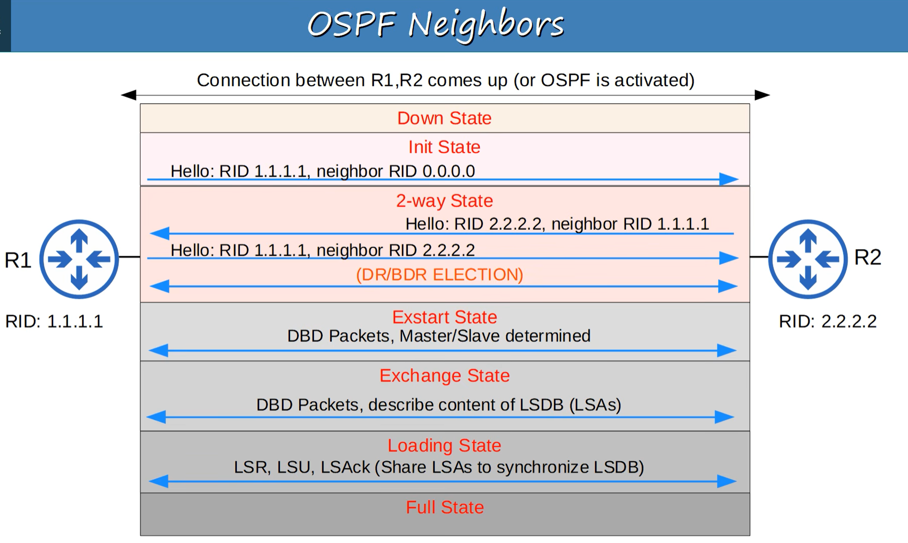

# OSPF Part 2 — Revision Notes

## 1. OSPF Cost

**OSPF metric = Cost**

**Default formula:**

> `Cost = Reference Bandwidth ÷ Interface Bandwidth`

* Default reference bandwidth = **100 Mbps**
* Cost cannot be less than **1**
* Faster interfaces can therefore have the same cost by default.

| Interface | Default Cost |
| --------- | -----------: |
| 10 Mbps   |           10 |
| 100 Mbps  |            1 |
| 1 Gbps    |            1 |
| 10 Gbps   |            1 |

### Change Reference Bandwidth

```cisco
router ospf 1
 auto-cost reference-bandwidth 100000
```

* Value is in **Mbps**
* Recommended to make it higher than the fastest links.
* **Must be consistent across all OSPF routers.**

### Manually Change Interface Cost

```cisco
interface g0/0
 ip ospf cost 10000
```

This takes priority over the automatically calculated cost.

### Interface Bandwidth

```cisco
interface g0/0
 bandwidth 100000
```

* Value is in **Kbps**
* Changes the value used for calculations, **not the physical interface speed**.
* **Not recommended** just to change OSPF cost.

### Useful command

```cisco
show ip ospf interface brief
```

---

# 2. OSPF Route Cost

A route's cost = **total cost of the outgoing/exit interfaces along the path.**

Example:

`R1 → R2 → R4`

`100 + 100 + 100 = 300`

**Loopback interfaces have a cost of 1.**

---

# 3. OSPF Neighbors

OSPF routers must become **neighbors** before they can exchange routing information.

When OSPF is activated:

1. Router sends **Hello** messages.
2. Routers check compatibility.
3. They establish a neighbor relationship.
4. They exchange LSAs.
5. They synchronize their LSDBs.

### Important defaults

* Hello timer: **10 seconds** on Ethernet
* Dead timer: **40 seconds**
* OSPF multicast: **224.0.0.5**
* OSPF IP protocol number: **89**

---

# 4. OSPF Neighbor States ⭐

Remember the order:
> **Down → Init → 2-Way → Exstart → Exchange → Loading → Full**



### Down

* No OSPF neighbor information yet.
* Hello messages begin.

### Init

* Router receives a Hello.
* Its own RID is **not yet listed** in the received Hello.

### 2-Way

* Router receives a Hello containing **its own RID**.
* Routers are now **OSPF neighbors**.
* DR/BDR election can occur on applicable network types.

### Exstart

* Routers decide **Master/Slave** for the initial database exchange.
* **Higher RID = Master**
* DBD packets are used.

### Exchange

* Routers exchange **DBD (Database Description)** packets.
* DBDs contain information about which LSAs they have.

### Loading

* Routers request missing LSAs using **LSR (Link State Request)**.
* LSAs are sent using **LSU (Link State Update)**.
* **LSAck** confirms receipt.

### Full

* Full OSPF adjacency established.
* Routers have **identical LSDBs**.
* Hellos continue to maintain the relationship.

---

# 5. OSPF Message Types ⭐

| # | Message   | Purpose                     |
| - | --------- | --------------------------- |
| 1 | **Hello** | Discover/maintain neighbors |
| 2 | **DBD**   | Describe LSDB contents      |
| 3 | **LSR**   | Request missing LSAs        |
| 4 | **LSU**   | Send LSAs                   |
| 5 | **LSAck** | Acknowledge LSAs            |

### Easy memory

**H → D → R → U → Ack**

**Hello → DBD → Request → Update → Acknowledge**

---

# 6. Neighbor vs Full Adjacency

**2-Way = neighbors**

**Full = fully adjacent + synchronized LSDB**

Basic OSPF process:

> **Become neighbors → Exchange LSAs → Calculate best routes**

---

# 7. OSPF Show Commands

```cisco
show ip ospf neighbor
```

* Shows OSPF neighbors and their states.
* Check for **FULL** state.

```cisco
show ip ospf interface
```

* Shows Hello/Dead timers, cost, neighbors, etc.

---

# 8. Additional OSPF Configuration

### Enable OSPF directly on an interface

Instead of `network`:

```cisco
interface g0/0
 ip ospf 1 area 0
```

Format:

```cisco
ip ospf <process-id> area <area-id>
```

### Make all interfaces passive by default

```cisco
router ospf 1
 passive-interface default
```

Then make specific interfaces active:

```cisco
no passive-interface g0/0
```

---

# 🔥 CCNA Must-Know

Memorize these:

* **OSPF metric = Cost**
* **Cost = Reference BW ÷ Interface BW**
* Default reference BW = **100 Mbps**
* Minimum cost = **1**
* Hello = **10 sec**
* Dead = **40 sec**
* Multicast = **224.0.0.5**
* IP protocol = **89**
* Neighbor states: **Down → Init → 2-Way → Exstart → Exchange → Loading → Full**
* **Higher RID = Master** in Exstart
* **Full = adjacency + identical LSDB**
* OSPF message types: **Hello, DBD, LSR, LSU, LSAck**
* `auto-cost reference-bandwidth` → **Mbps**
* `bandwidth` → **Kbps**
* `ip ospf cost` → manually set interface cost
