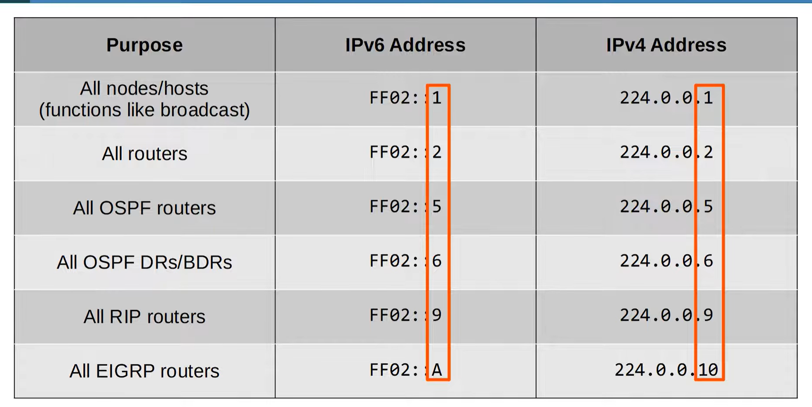

# IPv6 Part 2 — Day 32 Notes

## 1. EUI-64

**EUI-64** automatically generates the **64-bit Interface ID** of an IPv6 `/64` address from a **48-bit MAC address**.

### EUI-64 conversion — memorize

Given a MAC address:

1. **Split** the MAC in half.
2. Insert **`FFFE`** in the middle.
3. **Invert the 7th bit** of the original MAC.

Example:

```text
MAC:       12:34:56:78:90:AB
Split:     12:34:56 | 78:90:AB
Add FFFE:  12:34:56:FFFE:78:90:AB
```

Then invert the **7th bit**.

### Why the 7th bit?

The 7th bit is the **U/L (Universal/Local) bit**.

For EUI-64, its meaning is reversed:

* `0` → `1`
* `1` → `0`

**CCNA:** Know the conversion steps; the deeper reason for the bit inversion is not necessary.

### Configure EUI-64

```cisco
interface g0/0
ipv6 address 2001:db8::/64 eui-64
no shut
```

The router combines:

```text
IPv6 prefix + EUI-64 Interface ID
```

---

# 2. IPv6 Address Types

Know these:

| Type               | Purpose            | Range / Address                    |
| ------------------ | ------------------ | ---------------------------------- |
| **Global Unicast** | Public/Internet    | Generally routable IPv6            |
| **Unique Local**   | Private/internal   | `FC00::/7`, practically `FD00::/8` |
| **Link-Local**     | Local link/subnet  | `FE80::/10`                        |
| **Multicast**      | One-to-many        | `FF00::/8`                         |
| **Anycast**        | One-to-one-of-many | No special range                   |

---

# 3. Global Unicast

**Global Unicast = public IPv6 address.**

* Used over the Internet.
* Expected to be globally unique.
* Originally defined as `2000::/3`.
* Current allocation includes addresses not reserved for other purposes.

Typical structure:

```text
Global Routing Prefix | Subnet ID | Interface ID
       48 bits             16 bits       64 bits
```

Example:

```text
2001:db8:1234:0001:....
|------ /48 ------|
                  |-- /64 --|
```

### Remember

**Global Routing Prefix + Subnet ID = Network Prefix**

The final 64 bits are the **Interface ID**.

---

# 4. Unique Local

**Unique Local = private/internal IPv6.**

Similar concept to private IPv4.

* Not routed over the public Internet.
* No registration required.
* Used inside organizations.
* Range: `FC00::/7`
* Practically used addresses begin with **`FD`**.

### Structure

```text
FD | Global ID | Subnet ID | Interface ID
 8     40 bits     16 bits       64 bits
```

### Global ID

The **40-bit Global ID** should be randomly generated.

Why?

> To reduce the chance of overlapping IPv6 networks if organizations later connect/merge.

🔥 **Memorize:**

```text
Global Unicast → Public
Unique Local   → Private
```

---

# 5. Link-Local

**Link-local addresses are automatically generated on IPv6-enabled interfaces.**

Range:

```text
FE80::/10
```

In practice, they begin with:

```text
FE80
```

They are only valid on the **local link/subnet**.

Routers **do not route** packets to a link-local destination across subnets.

### Enable IPv6 without configuring an IPv6 address

```cisco
interface g0/0
ipv6 enable
```

This generates a link-local address.

### Uses

Link-local addresses are important for:

* **OSPFv3 neighbor adjacencies**
* IPv6 routing next-hop addresses
* **NDP** (Neighbor Discovery Protocol)

Example:

```text
R1 → R2 → R3
```

Routers can use:

```text
FE80::3
```

as a next-hop address.

But R1 cannot simply route a packet to R3's `FE80::` address across multiple links.

🔥 **Key idea:**

> **Link-local = local link only, not routed.**

---

# 6. IPv6 Multicast

IPv6 multicast range:

```text
FF00::/8
```

Multicast = **one-to-many**.

IPv6 **does NOT use broadcast**.

Instead, IPv6 uses multicast groups to perform functions that would use broadcast in IPv4.

### Important multicast addresses



### Easy memory trick

IPv4 and IPv6 multicast addresses often end with the **same number**:

```text
224.0.0.5  → FF02::5   OSPF
224.0.0.6  → FF02::6   OSPF DR/BDR
224.0.0.10 → FF02::A   EIGRP
```

---

# 7. IPv6 Multicast Scopes

The **4th hexadecimal character** indicates the scope.

| Scope                        | Prefix | Meaning                   |
| ---------------------------- | ------ | ------------------------- |
| Interface-local / node-local | `FF01` | Stays on the local device |
| Link-local                   | `FF02` | Local subnet/link         |
| Site-local                   | `FF05` | Physical site             |
| Organization-local           | `FF08` | Organization              |
| Global                       | `FF0E` | Global scope              |

⚠️ Don't confuse:

```text
FE80::/10 = Link-local ADDRESS
FF02::/16 = Link-local MULTICAST SCOPE
```

They are different concepts.

---

# 8. Anycast

**Anycast = one-to-one-of-many.**

Multiple routers use the **same IPv6 address**.

```text
        ┌─ R1 ─┐
Host ───┼─ R2 ─┼── same IPv6 address
        └─ R3 ─┘
```

The routing protocol sends traffic to the **nearest destination according to the routing metric**.

### Important

* No special anycast address range.
* Uses a normal unicast address.
* Multiple routers advertise the same address.
* Configure it with the `anycast` keyword.

Example:

```cisco
interface g0/0
ipv6 address 2001:db8::1/128 anycast
```

`/128` = single IPv6 address/host route.

---

# 9. Other Important IPv6 Addresses

### Unspecified address

```text
::
```

Equivalent concept to IPv4:

```text
0.0.0.0
```

Used when a device does not yet know its IPv6 address.

Also used in the IPv6 default route:

```text
::/0
```

### Loopback

```text
::1
```

Equivalent concept to IPv4 loopback:

```text
127.0.0.0/8
```

`::1` is used to test the local IPv6 protocol stack.

Traffic to `::1` stays **inside the local device**.

---

# 🔥 Day 32 — CCNA Must Memorize

```text
EUI-64:
1. Split MAC
2. Insert FFFE
3. Invert 7th bit
```

```text
Global Unicast → Public
Unique Local   → Private
Link-Local     → Local link
Multicast      → One-to-many
Anycast        → One-to-one-of-many
```

### Ranges

```text
Global Unicast → generally Internet-routable
Unique Local   → FC00::/7 (practically FD)
Link-Local     → FE80::/10
Multicast      → FF00::/8
```

### Critical multicast

```text
FF02::1  → All nodes
FF02::2  → All routers
FF02::5  → OSPF routers
FF02::6  → OSPF DR/BDR
FF02::A  → EIGRP routers
```

### Special addresses

```text
::       → Unspecified
::/0     → Default route
::1      → Loopback
```

### Biggest IPv6 concept

**IPv6 has no broadcast.**
Multicast replaces broadcast functionality where needed.
