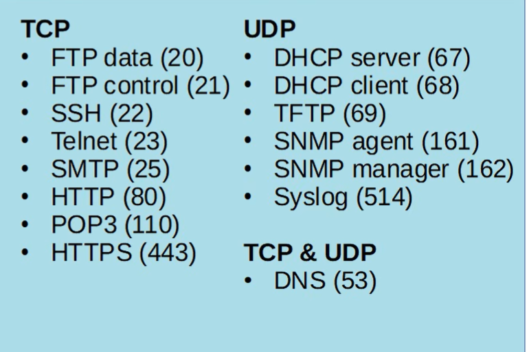

# CCNA Day 35 — Extended ACLs

## 1. Extended ACLs

**Extended ACLs** work like standard ACLs, but they can match much more specific traffic.

### Standard vs Extended

| ACL          | Matches                                                          |
| ------------ | ---------------------------------------------------------------- |
| **Standard** | Source IP only                                                   |
| **Extended** | Protocol + Source IP + Destination IP + Source/Destination ports |

Extended ACLs allow you to specify **exactly what traffic** should be permitted or denied.

---

# 2. Extended ACL Number Ranges

### Extended numbered ACLs

```text
100–199
2000–2699
```

### 🔥 Memorize both

**Standard:**

```text
1–99
1300–1999
```

**Extended:**

```text
100–199
2000–2699
```

---

# 3. Numbered ACLs Using Subcommands

Modern Cisco IOS allows numbered ACLs to be configured using the same configuration style as named ACLs.

Example:

```cisco
ip access-list standard 1
deny host 192.168.1.1
permit any
```

Instead of:

```cisco
access-list 1 deny 192.168.1.1
access-list 1 permit any
```

### Why use subcommand/named ACL mode?

It makes editing much easier.

You can:

* Delete individual entries
* Insert entries between existing entries
* Manually specify sequence numbers

---

# 4. Editing ACLs

Suppose you have:

```text
10 deny ...
20 permit ...
30 deny ...
40 permit ...
```

From ACL configuration mode:

```cisco
no 30
```

This deletes **only entry 30**.

### Traditional numbered ACL configuration

If you try to remove an individual entry from global config mode, you end up deleting the **entire ACL**, rather than just that entry.

Therefore:

> **Use ACL configuration mode when you need to edit individual entries.**

---

# 5. Inserting Entries

You can manually specify a sequence number:

```cisco
30 deny 192.168.2.0 0.0.0.255
```

If the ACL currently has:

```text
10 ...
20 ...
40 ...
```

the new entry becomes:

```text
10 ...
20 ...
30 deny ...
40 ...
```

---

# 6. ACL Resequencing

Useful when sequence numbers don't leave enough space to insert new entries.

### Syntax

```cisco
ip access-list resequence <ACL-ID> <starting-number> <increment>
```

Example:

```cisco
ip access-list resequence 1 10 10
```

Means:

* ACL = `1`
* First entry starts at `10`
* Each following entry increases by `10`

Example:

```text
Before:

1
2
3
4
5

After:

10
20
30
40
50
```

### Applies to:

* Numbered ACLs
* Named ACLs
* Standard ACLs
* Extended ACLs

---

# 7. Extended ACL Configuration

### Numbered

```cisco
access-list <number> {permit | deny} <protocol> <source> <destination>
```

Extended ranges:

```text
100–199
2000–2699
```

### Named

```cisco
ip access-list extended <name>
```

Then configure entries inside ACL configuration mode.

Example:

```cisco
ip access-list extended BLOCK_WEB
deny tcp any host 10.0.0.1 eq 443
permit ip any any
```

---

# 8. Protocol Matching

Extended ACLs can match the Layer 4/IP protocol.

Important protocol numbers:

| Protocol | IP Protocol Number |
| -------- | -----------------: |
| ICMP     |              **1** |
| TCP      |              **6** |
| UDP      |             **17** |
| EIGRP    |             **88** |
| OSPF     |             **89** |

Usually you'll use the protocol name:

```cisco
tcp
udp
icmp
```

rather than the number.

### `ip`

The `ip` option matches **all IP packets**.

So:

```cisco
permit ip any any
```

is the extended-ACL equivalent of:

```text
permit everything
```

---

# 9. Source and Destination IP

Example:

```cisco
deny tcp any 10.0.0.0 0.0.0.255
```

Means:

> Deny TCP traffic from **any source** to `10.0.0.0/24`.

### Important difference from standard ACLs

For an extended ACL, a `/32` must be written using either:

```cisco
host 1.1.1.1
```

or:

```cisco
1.1.1.1 0.0.0.0
```

You **cannot simply write**:

```text
1.1.1.1
```

for a /32 in an extended ACL.

---

# 10. Basic Extended ACL Examples

### Permit everything

```cisco
permit ip any any
```

---

### Block UDP from `10.0.0.0/16` to `192.168.1.1`

```cisco
deny udp 10.0.0.0 0.0.255.255 host 192.168.1.1
```

---

### Block ping from `172.16.1.1` to `192.168.0.0/24`

Ping uses **ICMP**:

```cisco
deny icmp host 172.16.1.1 192.168.0.0 0.0.0.255
```

---

# 11. TCP/UDP Port Matching

You can match source and/or destination ports when using:

```text
TCP
UDP
```

Without a port specified:

```cisco
deny tcp any any
```

means **all TCP ports**.

---

## Port Operators

| Operator | Meaning        |
| -------- | -------------- |
| `eq`     | Equal to       |
| `gt`     | Greater than   |
| `lt`     | Less than      |
| `neq`    | Not equal      |
| `range`  | Range of ports |

### Examples

```cisco
eq 80
```

Port exactly 80.

```cisco
gt 80
```

Ports 81 and above.

```cisco
lt 80
```

Ports 79 and below.

```cisco
neq 80
```

Every port except 80.

```cisco
range 80 100
```

Ports 80–100.

### Most commonly used

```text
eq
```

---

# 12. Destination Port Example

To deny HTTP traffic to `1.1.1.1`:

```cisco
deny tcp any host 1.1.1.1 eq 80
```

This means:

```text
TCP
 ↓
any source
 ↓
destination = 1.1.1.1
 ↓
destination port = 80
 ↓
DENY
```

HTTP = TCP **80**

HTTPS = TCP **443**

---

# 13. Important Ports

From Day 30:

| Service |    Port | Protocol |
| ------- | ------: | -------- |
| FTP     |   20/21 | TCP      |
| SSH     |      22 | TCP      |
| Telnet  |      23 | TCP      |
| SMTP    |      25 | TCP      |
| HTTP    |      80 | TCP      |
| POP3    |     110 | TCP      |
| HTTPS   | **443** | TCP      |
| DHCP    |   67/68 | UDP      |
| TFTP    |      69 | UDP      |
| SNMP    | 161/162 | UDP      |
| Syslog  |     514 | UDP      |

For ACL questions, especially know:

**HTTP = 80**
**HTTPS = 443**
**SSH = 22**
**Telnet = 23**

---

# 14. Extended ACLs Match ALL Specified Parameters

This is extremely important.

Suppose:

```cisco
deny tcp 172.16.1.0 0.0.0.255 gt 9999 host 4.4.4.4 neq 23
```

A packet must match **every specified condition**:

* TCP
* Source = `172.16.1.0/24`
* Source port > `9999`
* Destination = `4.4.4.4`
* Destination port ≠ `23`

If even **one condition doesn't match**, that ACE doesn't match the packet.

---

# 15. Other Extended ACL Options

The lesson mentions options such as:

```text
ACK
FIN
SYN
TTL
DSCP
```

These are **not necessary to learn for the CCNA** according to the lesson.

Focus on:

```text
Protocol
Source IP
Destination IP
Source port
Destination port
```

---

# 16. Extended ACL Placement

This is one of the most important differences from standard ACLs.

### Standard ACL

> **Close to the destination**

Because it only knows the **source IP**, placing it near the source could block too much traffic.

### Extended ACL

> **Close to the source**

Because extended ACLs are much more specific.

This allows unwanted traffic to be dropped **as early as possible**, avoiding unnecessary processing farther into the network.

### 🔥 Memorize

```text
STANDARD → destination
EXTENDED  → source
```

---

# 17. Extended ACL Example

Requirement:

> Hosts in `192.168.1.0/24` cannot use HTTPS to access SRV1 (`10.0.1.100`).

HTTPS = TCP 443.

```cisco
ip access-list extended BLOCK_HTTPS
deny tcp 192.168.1.0 0.0.0.255 host 10.0.1.100 eq 443
permit ip any any
```

Apply close to the source:

```cisco
interface g0/1
ip access-group BLOCK_HTTPS in
```

Traffic is denied as soon as it enters R1.

---

# 18. Another Example

Requirement:

> `192.168.2.0/24` cannot access `10.0.2.0/24`.

Because we don't care about the protocol, use:

```cisco
ip access-list extended BLOCK_ACCESS
deny ip 192.168.2.0 0.0.0.255 10.0.2.0 0.0.0.255
permit ip any any
```

Apply close to source:

```cisco
interface g0/2
ip access-group BLOCK_ACCESS in
```

---

# 19. Blocking Ping

Ping uses **ICMP**.

Example:

```cisco
deny icmp 192.168.1.0 0.0.0.255 10.0.1.0 0.0.0.255
```

This blocks ICMP traffic from:

```text
192.168.1.0/24
```

to:

```text
10.0.1.0/24
```

---

# 20. Verification

To see ACLs:

```cisco
show access-lists
```

```cisco
show ip access-lists
```

To see which ACLs are applied to an interface:

```cisco
show ip interface <interface>
```

Example:

```cisco
show ip interface g0/1
```

The output shows whether an ACL is applied:

```text
Inbound access list is ...
Outbound access list is ...
```

or:

```text
not set
```

---

# 🔥 Day 35 — CCNA Must-Know

### Standard vs Extended

```text
STANDARD
→ Source IP only

EXTENDED
→ Protocol
→ Source IP
→ Destination IP
→ Source port
→ Destination port
```

### ACL ranges

```text
STANDARD
1–99
1300–1999

EXTENDED
100–199
2000–2699
```

### Placement

```text
STANDARD → close to DESTINATION
EXTENDED → close to SOURCE
```

### Protocol numbers

```text
ICMP  = 1
TCP   = 6
UDP   = 17
EIGRP = 88
OSPF  = 89
```

### Port operators

```text
eq     = equal
gt     = greater than
lt     = less than
neq    = not equal
range  = range
```

### Common examples

```text
HTTP  = TCP 80
HTTPS = TCP 443
SSH   = TCP 22
Telnet = TCP 23
```

### `/32` in extended ACLs

Use:

```cisco
host 1.1.1.1
```

or:

```cisco
1.1.1.1 0.0.0.0
```

### Permit everything

```cisco
permit ip any any
```

### ACL processing

```text
TOP → BOTTOM
FIRST MATCH → ACTION → STOP
NO MATCH → IMPLICIT DENY
```

### Editing

```cisco
no <sequence-number>
```

### Resequencing

```cisco
ip access-list resequence <ACL> <start> <increment>
```

### Verify applied ACL

```cisco
show ip interface <interface>
```

## The biggest Day 34 + 35 exam picture

```text
                 ACLs
                   │
          ┌────────┴────────┐
          │                 │
      STANDARD          EXTENDED
          │                 │
     Source IP       Protocol + Source
       only          + Destination
                     + Ports
          │                 │
   Near DESTINATION    Near SOURCE
          │                 │
     1–99 / 1300–     100–199 /
        1999          2000–2699
```
